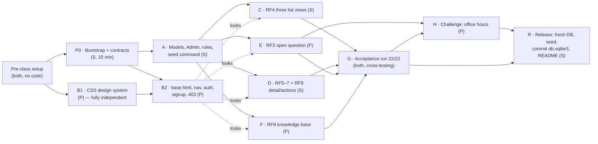

# AskTA — Teaching Assistant Support System · Project Plan

> **Course:** Rapid Application Development (RAD) · IFPB · Extra-credit activity
> **Team:** Suetone Carneiro · Pedro Lucas
> **Stack:** Python 3.12+ · Django 5.2 LTS · SQLite · hand-written CSS (no third-party libraries)
> **Time box:** 150 minutes in class. Whatever is on `main` at the end is what gets graded.

This file is the contract between the two of us. If you're about to break something in it (a model field, a URL name, a CSS class), tell your partner **first**.

---

## Table of contents

1. [Ground rules from the spec](#1-ground-rules-from-the-spec)
2. [Decisions already made](#2-decisions-already-made)
3. [Glossary (PT → EN)](#3-glossary-pt--en)
4. [Architecture & file ownership](#4-architecture--file-ownership)
5. [Contracts (write these first, then work in parallel)](#5-contracts-write-these-first-then-work-in-parallel)
6. [Dependency map: what is independent and what is not](#6-dependency-map-what-is-independent-and-what-is-not)
7. [Work tracks](#7-work-tracks)
8. [Timeline (150 min)](#8-timeline-150-min)
9. [Git workflow](#9-git-workflow)
10. [Requirement traceability](#10-requirement-traceability)
11. [Test data](#11-test-data)
12. [Acceptance checklist (22 items)](#12-acceptance-checklist-22-items)
13. [UI / UX design](#13-ui--ux-design)
14. [Optional challenge: office hours (+0.5)](#14-optional-challenge-office-hours-05)
15. [Delivery & README](#15-delivery--readme)
16. ["Explain it" cheat sheet](#16-explain-it-cheat-sheet)
17. [Out of scope](#17-out-of-scope)

---

## 1. Ground rules from the spec

- **150 minutes, no finishing at home.** Only this plan is written before class. All code is written in class.
- **AI assistants are allowed**, but **both of us must be able to explain any line** of the delivery. Code we can't explain earns no points. → after every meaningful push, the author explains it to the other person (see §9).
- **One public GitHub repo, commits from both members.** The history will be checked.
- **Priority rule from the spec:** if we're behind at the halfway point, **RF4 (the three list views) comes first**. It's the requirement that counts most.
- **Never test only with the superuser.** It passes every permission check.

### Technical restrictions (all mandatory)

| # | Restriction | How we satisfy it |
|---|---|---|
| T1 | Author never appears in the form | `QuestionForm.Meta.fields = ["subject", "title", "description"]`; the view sets `form.instance.author = request.user` |
| T2 | Status changes happen on the server, never through a user-editable field | `status` isn't in any form; it only changes inside the claim/answer/close views |
| T3 | Don't use `is_superuser` as an authorization criterion | We use groups, the custom permission `questions.view_all_questions`, and the `Subject.monitors` relationship. `grep is_superuser` must return nothing |
| T4 | At least one decorator protection **and** one mixin protection | Decorator: `@login_required` on `claim_question`, `close_question`, `knowledge_base`. Mixins: `LoginRequiredMixin` + `UserPassesTestMixin` on the CBVs |
| T5 | Monitor view = **one** DB query crossing the relationship | `Question.objects.filter(Q(subject__monitors=user) \| Q(author=user)).distinct()` (see §5.3) |
| T6 | No third-party libraries | `requirements.txt` contains only `Django`. No Bootstrap, no CDN, no Google Fonts: hand-written CSS + system font stack |
| T7 | No password assigned directly to the model field | Users are created with `create_user` / `create_superuser` / `UserCreationForm`, which all hash through `set_password` |

---

## 2. Decisions already made

| Topic | Decision | Why |
|---|---|---|
| User model | Django's built-in `auth.User` (no custom user) | Nothing in the spec needs extra user fields. Less to build and explain |
| **Roles** | **Hybrid.** *Student* = group `Students`. *Professor* = group `Professors`, which holds the custom permission `questions.view_all_questions`. *Monitor* = **derived** from `Subject.monitors` (no group) | Being a monitor is **per subject**, which the spec needs anyway (RF5). Deriving it means the role can never get out of sync with the data |
| **Monitor's list** | Questions from monitored subjects **plus the ones the monitor opened**, still in **one query** | A monitor is usually also a student, and RF3 lets any authenticated user ask. Without this, a monitor's own questions in other subjects would disappear. We'll justify this in the README |
| Styling | Hand-written CSS design system, light + dark mode | T6 compliance. Also looks more distinctive than stock Bootstrap |
| Optional challenge | Planned as the **last** track, pushed only after the acceptance checklist is 22/22 green | It only scores if everything else works |
| Test data | A `seed_demo` management command builds the demo data. The final `db.sqlite3` is produced from it once, at the end | Both of us get identical local DBs, and there are no binary merge conflicts on `db.sqlite3` (see §9) |
| DEBUG | Stays `True` in the delivered repo | The grader runs `runserver` locally, and static files are only served with `DEBUG=True` |
| Timezone / language | `TIME_ZONE = "America/Fortaleza"` (covers Paraíba), `LANGUAGE_CODE = "en-us"` | The UI is in English |

---

## 3. Glossary (PT → EN)

The spec is in Portuguese; the code and UI are in English. The professor will ask in Portuguese, so keep this mapping in your head.

| Spec (PT) | Code | UI label |
|---|---|---|
| Disciplina | `Subject` | Subject |
| Dúvida | `Question` | Question |
| Aluno | group `Students` | Student |
| Monitor | `Subject.monitors` (M2M) | Monitor |
| Professor | group `Professors` + perm `view_all_questions` | Professor |
| Monitor responsável | `Question.assigned_monitor` | Assigned monitor |
| Resposta | `Question.answer` | Answer |
| Situação | `Question.status` | Status |
| Aberta / Em atendimento / Respondida / Encerrada | `open` / `in_progress` / `answered` / `closed` | Open / In progress / Answered / Closed |
| Assumir / Responder / Encerrar | `claim` / `answer` / `close` | Claim / Answer / Mark as resolved |
| Base de conhecimento | `knowledge_base` | Knowledge base |
| Horários de atendimento | `OfficeHour` (app `schedules`) | Office hours |

---

## 4. Architecture & file ownership

**S** = Suetone, **P** = Pedro, **P0** = written by Suetone in the bootstrap step, then frozen as a contract.

```
teaching-assistant-system-rad/
├── manage.py                                  P0
├── requirements.txt                           P0   (Django==5.2.*)
├── config/                                    P0   project package
│   ├── settings.py                            P0   (change only with a heads-up)
│   └── urls.py                                P0   admin/, accounts/, questions/, "" → redirect
├── accounts/                                  P    signup + roles
│   ├── roles.py                               P0   group-name constants (contract)
│   ├── views.py                               P    SignUpView
│   └── urls.py                                P0→P
├── questions/                                 S    core domain
│   ├── models.py                              S    Subject, Question, QuestionQuerySet
│   ├── admin.py                               S
│   ├── migrations/                            S    ⚠ only S runs makemigrations in this app
│   ├── management/commands/seed_demo.py       S
│   ├── forms.py                               P0   QuestionForm (P) · AnswerForm (S), stubs kept apart
│   ├── urls.py                                P0   all routes defined up front (contract)
│   └── views/                                 P0   one module per feature, so we never edit the same file
│       ├── __init__.py                        P0   re-exports every view
│       ├── listing.py                         S    RF4  QuestionListView
│       ├── create.py                          P    RF3  QuestionCreateView
│       ├── detail.py                          S    RF9  QuestionDetailView + AnswerView (RF6)
│       ├── actions.py                         S    RF5/RF7  claim_question, close_question
│       └── knowledge.py                       P    RF8  knowledge_base
├── schedules/                                 P    optional challenge (own app = own migrations)
├── templates/
│   ├── base.html                              P    layout, nav, flash messages
│   ├── 403.html                               P    "Access denied" page
│   ├── registration/login.html                P
│   ├── registration/signup.html               P
│   ├── questions/question_list.html           S
│   ├── questions/question_detail.html         S
│   ├── questions/question_form.html           P
│   └── questions/knowledge_base.html          P
├── static/css/app.css                         P    design system (§5.5)
├── README.md                                  P drafts · S finalizes credentials
└── db.sqlite3                                 S    committed ONCE, in the final release step
```

**Why a `views/` package instead of one `views.py`?** Each person owns whole files, so parallel pushes to `main` rebase without conflicts. `__init__.py` re-exports everything, so `urls.py` stays unchanged.

---

## 5. Contracts (write these first, then work in parallel)

Once these are pushed (end of **P0** and **Track A**), every other track can be built without waiting for anyone.

### 5.1 Models (`questions/models.py`, owner S)

```python
class Subject(models.Model):
    name       = CharField(max_length=100)                        # required
    code       = CharField(max_length=20, unique=True)            # unique
    is_active  = BooleanField(default=True)                       # inactive → no new questions
    monitors   = ManyToManyField(User, blank=True,
                                 related_name="monitored_subjects")
    # Meta: ordering = ["code"]; __str__ → "RAD101 · Rapid Application Development"

class Question(models.Model):
    class Status(models.TextChoices):
        OPEN        = "open",        "Open"
        IN_PROGRESS = "in_progress", "In progress"
        ANSWERED    = "answered",    "Answered"
        CLOSED      = "closed",      "Closed"

    title            = CharField(max_length=200)                  # required
    description      = TextField()
    subject          = ForeignKey(Subject, on_delete=PROTECT, related_name="questions")
    author           = ForeignKey(User, on_delete=CASCADE,   related_name="questions_asked")
    assigned_monitor = ForeignKey(User, on_delete=SET_NULL,  related_name="questions_assigned",
                                  null=True, blank=True)          # starts empty
    answer           = TextField(blank=True)                      # starts empty
    status           = CharField(max_length=20, choices=Status.choices, default=Status.OPEN)
    created_at       = DateTimeField(auto_now_add=True)
    updated_at       = DateTimeField(auto_now=True)

    objects = QuestionQuerySet.as_manager()
    # Meta: ordering = ["-updated_at"]
    #       permissions = [("view_all_questions", "Can view all questions")]
```

`on_delete` choices, to justify in the README:
- `subject → PROTECT`: deleting a subject must not wipe its question history. You deactivate it (`is_active=False`) instead.
- `author → CASCADE`: a question belongs to the person who asked it.
- `assigned_monitor → SET_NULL`: if a monitor account is removed, the question survives.
- Two FKs point to `User`, so **`related_name` is mandatory**. This is the first "common symptom" in the spec.

### 5.2 Business rules live in the model (single source of truth)

The views (server-side protection) and the templates (RF9 button visibility) both call these, so the UI and the server can never disagree.

```python
Question.is_monitor(user)          -> bool  # subject.monitors.filter(pk=user.pk).exists()
Question.can_be_claimed_by(user)   -> bool  # is_monitor(user) and status == OPEN and author != user
Question.can_be_answered_by(user)  -> bool  # assigned_monitor_id == user.id and status in (IN_PROGRESS, ANSWERED)
Question.can_be_closed_by(user)    -> bool  # author_id == user.id and status == ANSWERED
```

`status == CLOSED` makes every `can_*` return `False`. That covers "a closed question accepts no more changes."

### 5.3 Visibility queries (`QuestionQuerySet`, owner S)

```python
PUBLIC_STATUSES = [Status.ANSWERED, Status.CLOSED]

def visible_to(self, user):                       # RF4: the ONE list page
    if user.has_perm("questions.view_all_questions"):   # Professor
        return self.all()
    return self.filter(Q(author=user) | Q(subject__monitors=user)).distinct()
    #  Student  → only matches author=user
    #  Monitor  → crosses Question → Subject → monitors in ONE query (T5)

def readable_by(self, user):                      # detail page access
    # visible_to(user) OR status in PUBLIC_STATUSES (knowledge-base items)

def knowledge_base(self):                         # RF8
    return self.filter(status__in=PUBLIC_STATUSES)
```

`.distinct()` is needed because the M2M join produces one row per monitor of the subject.

### 5.4 URL contract (`questions/urls.py`, `accounts/urls.py`, P0)

| Name | Path | Method | View | Owner |
|---|---|---|---|---|
| `login` | `/accounts/login/` | GET/POST | Django `LoginView` | built-in |
| `logout` | `/accounts/logout/` | **POST** (Django 5) | Django `LogoutView` | built-in |
| `signup` | `/accounts/signup/` | GET/POST | `SignUpView` | P |
| — | `/` | GET | redirect → `questions:list` | P0 |
| `questions:list` | `/questions/` | GET | `QuestionListView` | S |
| `questions:create` | `/questions/new/` (optional `?subject=<pk>`) | GET/POST | `QuestionCreateView` | P |
| `questions:detail` | `/questions/<int:pk>/` | GET | `QuestionDetailView` | S |
| `questions:claim` | `/questions/<int:pk>/claim/` | **POST** | `claim_question` | S |
| `questions:answer` | `/questions/<int:pk>/answer/` | **POST** | `AnswerView` | S |
| `questions:close` | `/questions/<int:pk>/close/` | **POST** | `close_question` | S |
| `questions:knowledge_base` | `/questions/knowledge/` | GET (`?q=`) | `knowledge_base` | P |
| `schedules:mine` | `/schedules/` | GET/POST | challenge | P |

Settings: `LOGIN_URL = "login"`, `LOGIN_REDIRECT_URL = "questions:list"`, `LOGOUT_REDIRECT_URL = "login"`.

**Response policy** (the same everywhere, so the acceptance items behave predictably):
- Not logged in → redirect to login (criterion 1).
- Wrong **person or role** → `raise PermissionDenied` → **403** "Access denied" (criteria 12, 13, 18). The permission check runs **before** the HTTP-method check, so typing the URL in the browser also gives 403.
- Right person, **wrong state** (already claimed, no answer yet, blank answer) → `messages.error(...)` + redirect to the detail page (criteria 11, 15, 17).
- Success → `messages.success(...)` + redirect to the detail page.

### 5.5 UI contract: CSS classes (owner P; S uses them before they're styled)

Suetone's templates use these class names from minute one. They look plain until Pedro's CSS lands, then look right automatically.

| Area | Classes |
|---|---|
| Layout | `.container` `.page-header` (h1 + `.page-actions`) `.stack` `.grid` `.split` |
| Surfaces | `.card` `.card-header` `.card-body` `.card-footer` `.card-list` (list of clickable cards) |
| Buttons | `.btn` + `.btn-primary` / `.btn-secondary` / `.btn-success` / `.btn-ghost`, size `.btn-sm` |
| Status | `.badge .badge-{{ question.status }}` → `.badge-open` `.badge-in_progress` `.badge-answered` `.badge-closed` |
| Subject | `.tag` (monospace pill, e.g. `RAD101`) |
| Forms | `<form class="form">` + `{{ form.as_div }}`; CSS styles `label`, `input`, `select`, `textarea`, `.errorlist`, `.helptext` |
| Feedback | `.messages` > `.message.message-{{ message.tags }}` (success / error / info / warning) |
| Misc | `.muted` `.meta` (author · time row) `.empty-state` `.search-bar` `.stepper` > `.step.is-done / .is-current` `.qa-answer` |

Template blocks in `base.html`: ``, ``. Flash messages are rendered by `base.html`, not by individual pages.

---

## 6. Dependency map: what is independent and what is not



| Part | Hard dependencies | Can run in parallel with | Notes |
|---|---|---|---|
| **B1** CSS design system | none | everything | Start at T+0. It's a standalone `.css` file |
| **P0** Bootstrap | none | B1 | **Blocks everyone else**, so keep it to 10 min |
| **B2** Base/nav/auth/signup | P0 | A | Only needs the `Students` constant from `accounts/roles.py` |
| **A** Models/Admin/seed | P0 | B1, B2 | **Blocks C, D, E, F.** Merge ASAP (target T+40) |
| **C** RF4 list | A | D, E, F | Links to `questions:detail` by URL name only |
| **D** Detail + actions | A | C, E, F | Doesn't need C. You can reach `/questions/<pk>/` directly |
| **E** RF3 create | A | C, D, F | Uses `Subject.objects.filter(is_active=True)` |
| **F** RF8 knowledge base | A | C, D, E | Uses `Question.objects.knowledge_base()` |
| **G** Acceptance run | C, D, E, F, B2 | — | Integration point |
| **H** Office hours | A, E, and **G green** before pushing | can be *coded* locally during G | Own app, own migrations, so no migration conflicts with `questions` |
| **R** Release | G (+ H if pushed) | — | Only S commits `db.sqlite3` |

**Soft dependency:** C/D/E/F depend on B2 only for how they *look*. The UI contract (§5.5) removes that dependency during development.

---

## 7. Work tracks

### Pre-class (setup only, no project code)
- [ ] S: add Pedro as a collaborator on the GitHub repo.
- [ ] Both: clone, check `python --version` ≥ 3.12, and confirm you can push to `main`.
- [ ] Both: read this plan end to end. Each of us should be able to explain §5 without looking.

### P0 · Bootstrap + contracts — **S**, T+0 → T+10
- [ ] `python -m venv .venv`, `pip install "Django==5.2.*"`, `pip freeze > requirements.txt`
- [ ] `django-admin startproject config .` · `startapp accounts` · `startapp questions`
- [ ] settings: apps, `TEMPLATES.DIRS = [BASE_DIR / "templates"]`, `STATICFILES_DIRS = [BASE_DIR / "static"]`, login URLs, TZ, language. Keep the default `AUTH_PASSWORD_VALIDATORS` (criterion 2 depends on them)
- [ ] `accounts/roles.py`: `STUDENTS_GROUP = "Students"`, `PROFESSORS_GROUP = "Professors"`
- [ ] `questions/urls.py` with **all** routes from §5.4 (`app_name = "questions"`), each pointing to a stub view in its own module under `questions/views/`
- [ ] `questions/forms.py` with stub `QuestionForm` and `AnswerForm`
- [ ] `config/urls.py`: `admin/`, `accounts/` (`django.contrib.auth.urls` + signup), `questions/`, `""` → redirect
- [ ] `runserver` works → push to `main` → tell Pedro to pull

### A · Models, Admin, roles, seed — **S**, T+10 → T+40 (RF1)
- [ ] Models exactly as in §5.1–5.3, including the `can_*` methods and the QuerySet
- [ ] `makemigrations` + `migrate`
- [ ] Admin, **usable** (RF1):
  - `SubjectAdmin`: `list_display = (code, name, is_active, monitor_count)`, `list_filter = (is_active,)`, `search_fields = (code, name)`, **`filter_horizontal = ("monitors",)`**, so the monitor↔subject link is editable
  - `QuestionAdmin`: `list_display = (title, subject, author, assigned_monitor, status, created_at, updated_at)`, `list_filter = (status, subject)`, `search_fields = (title, description, author__username)`, `readonly_fields = (created_at, updated_at)`, `date_hierarchy = "created_at"`
- [ ] `seed_demo` command (§11), idempotent. Creates groups, assigns `view_all_questions` to `Professors`, users via `create_user`/`create_superuser`, subjects, M2M links, and questions in every status
- [ ] Push to `main` → explain it to Pedro. **Tell him A is on `main` so he can pull and migrate.**

### B1 · CSS design system — **P**, T+0 → T+20
- [ ] `static/css/app.css`: tokens (`:root` colors, spacing, radius, shadow), dark mode through `prefers-color-scheme`, and every class in §5.5
- [ ] System font stack, visible focus rings, responsive down to 360 px width

### B2 · Layout, navigation, auth — **P**, T+20 → T+45 (RF2)
- [ ] `base.html`: top nav with brand, links **Questions / Ask / Knowledge base** (+ **Office hours** for monitors, from H), a role chip, and a **POST** logout form. Flash messages go below the nav.
  - Role chip, template-only: `ProfessorMonitorStudent`
  - Anonymous users see only **Log in / Sign up**
- [ ] `registration/login.html`, `registration/signup.html`: centered auth cards
- [ ] `SignUpView(CreateView)` with Django's built-in `UserCreationForm`. In `form_valid`: save, then `Group.objects.get_or_create(name=STUDENTS_GROUP)` → `user.groups.add(...)`, then log in and redirect to the list. **No other permissions** (criterion 3). Weak passwords are rejected by Django's validators, with messages (criterion 2)
- [ ] `403.html`: friendly "Access denied" page with a way back

### C · RF4 three list views — **S**, T+40 → T+65 ⭐ highest weight
- [ ] `QuestionListView(LoginRequiredMixin, ListView)` → `get_queryset = Question.objects.visible_to(self.request.user).select_related("subject", "author", "assigned_monitor")`
- [ ] The heading changes with role: "My questions" / "Questions in your subjects" / "All questions"
- [ ] Each card shows title, subject tag, status badge, author, relative update time (`timesince`), and assigned monitor if any. The whole card links to the detail page
- [ ] Empty state with an "Ask a question" CTA
- [ ] Verify with **student_ana, student_bruno, monitor_carla and professor_diego**, not admin

### D · Detail, claim, answer, close + RF9 — **S**, T+65 → T+100
- [ ] `QuestionDetailView(LoginRequiredMixin, DetailView)`: `get_queryset = Question.objects.readable_by(user)` (others get 404). Context: `can_claim`, `can_answer`, `can_close`, `answer_form`, all computed from the §5.2 methods
- [ ] `claim_question` (`@login_required`): 403 if not a monitor of the subject → 405 if not POST → **atomic conditional update**
      `Question.objects.filter(pk=pk, status=OPEN, assigned_monitor__isnull=True).update(assigned_monitor=user, status=IN_PROGRESS, updated_at=now())`
      If 0 rows were updated → "This question was already claimed" (criterion 11, and this also covers two monitors racing)
- [ ] `AnswerView(LoginRequiredMixin, UserPassesTestMixin, UpdateView)`: `test_func` → `obj.assigned_monitor_id == user.id` (403 for the author/other monitors, criterion 13). `http_method_names = ["post"]`. `AnswerForm` makes `answer` required and strips whitespace (criterion 15). Wrong state or invalid form → message + redirect. Valid → `status = ANSWERED`
- [ ] `close_question` (`@login_required`): 403 if not the author (criterion 18) → 405 if not POST → if status != ANSWERED → message "Only answered questions can be closed" (criterion 17) → else CLOSED
- [ ] Template: status stepper (Open → In progress → Answered → Closed), description, answer block, and action panel:
  - Claim button **only if** `can_claim` (RF9)
  - Answer textarea **only if** `can_answer` (RF9)
  - "Mark as resolved" **only if** `can_close` (RF9)
  - Every button sits inside `<form method="post">` with ``

### E · RF3 open a question — **P**, T+45 → T+70
- [ ] `QuestionForm(ModelForm)`: `fields = ["subject", "title", "description"]`, and `subject` queryset = `Subject.objects.filter(is_active=True)`. Because the queryset is filtered, a forged POST with an inactive subject id **fails validation on the server** (criterion 22)
- [ ] `QuestionCreateView(LoginRequiredMixin, CreateView)`: `form_valid` sets `form.instance.author = request.user`. Status comes from the model default (OPEN). Success message → redirect to detail
- [ ] Supports `?subject=<pk>` as the initial value (needed later by H)
- [ ] No `author`, `assigned_monitor`, `answer` or `status` fields anywhere in the form (criteria 4, 5)

### F · RF8 knowledge base — **P**, T+70 → T+85
- [ ] `knowledge_base` function view, `@login_required`: `Question.objects.knowledge_base().select_related("subject")`, plus if `q`: `.filter(Q(title__icontains=q) | Q(description__icontains=q))`
- [ ] Page: search bar (GET, keeps the term), result count, cards showing **title, subject, description, answer**, and an empty state for "no results"
- [ ] Open / in-progress questions never show here (criterion 20)

### G · Acceptance run — **both**, T+100 → T+120
- [ ] `rm db.sqlite3 && migrate && seed_demo` on a **fresh** DB
- [ ] Cross-test: **S runs Pedro's features, P runs Suetone's** (§12). This is also how each of us learns the other's code
- [ ] Write every failure down (paper or a shared note), fix it, re-run it

### H · Office hours (optional) — **P**, coded T+85 → T+130 locally, pushed only if G = 22/22
See §14.

### R · Release — **S**, T+130 → T+145
See §15.

---

## 8. Timeline (150 min)

```mermaid
gantt
    title Class timeline (00:00 = start of class)
    dateFormat HH:mm
    axisFormat %H:%M
    section Suetone
    P0 Bootstrap + contracts      :s0, 00:00, 10m
    A Models, Admin, seed         :s1, after s0, 30m
    C RF4 three list views        :crit, s2, after s1, 25m
    D Detail + claim/answer/close :s3, after s2, 35m
    G Acceptance (tests P's work) :s4, after s3, 20m
    Check H + README credentials :s5, after s4, 10m
    R Release                     :crit, s6, after s5, 15m
    section Pedro
    B1 CSS design system          :p1, 00:00, 20m
    B2 Base, nav, auth, signup    :p2, after p1, 25m
    E RF3 open question           :p3, after p2, 25m
    F RF8 knowledge base          :p4, after p3, 15m
    H Office hours (local)       :p5, after p4, 15m
    G Acceptance (tests S's work) :p6, 01:40, 20m
    H finish + push if 22/22     :p7, after p6, 10m
```



### Checkpoints (say these out loud)
| When | Check | If it fails |
|---|---|---|
| **T+10** | P0 on `main`, both run the server | S keeps going, P keeps doing CSS. Nobody waits |
| **T+40** | Track A on `main`, migrations applied, seed runs | P builds E against the §5.1 contract and runs it once A lands |
| **T+75** (halfway) | **RF4 pushed and verified with the 4 non-admin accounts** | **P pauses F and pairs with S on RF4.** Spec priority |
| **T+100** | C, D, E, F all pushed | Cut list: H → KB polish → UI polish. Never cut RF4–RF7 |
| **T+120** | Checklist 22/22 | Fix only. No new features |
| **T+140** | **Code freeze.** Only `db.sqlite3` + README after this | — |
| **T+145** | Both open the GitHub repo in the browser and confirm the final commit is there | — |

---

## 9. Git workflow

1. **No branches, no PRs.** We both commit and push **directly to `main`** (we're side by side in class, so we coordinate by talking). `main` must always run: only push code where `python manage.py runserver` still starts.
2. **Small commits, pushed often:** one logical step per commit, pushed right away, so the other person gets it early and conflicts stay tiny. Both of our names end up in the history (the spec checks this).
3. **"Explain your push" rule:** after pushing something meaningful, turn to your partner and explain it in under 2 minutes. They ask **one question**. This is how we both end up able to explain everything.
4. **Stay in sync:** always `git pull --rebase origin main` **before every push**. If the rebase stops on a conflict, fix it together, then `git rebase --continue`.
5. **Announce shared-file edits out loud** before touching them: `config/settings.py`, `config/urls.py`, `questions/urls.py`, `questions/forms.py`, `base.html`.
6. **Migrations:** only **S** runs `makemigrations` for `questions`, and only **P** for `schedules`. Need a model change in `questions`? Ask S. Two people generating `0002_*.py` at the same time causes a migration conflict.
7. **`db.sqlite3` stays git-ignored until release.** It's binary, so conflicts can't be merged. Everyone rebuilds locally with `migrate && seed_demo`.
8. **`.venv/` is never committed.** (Already in `.gitignore`.)
9. Commit messages: `feat(questions): add visibility queryset`, `fix(kb): hide open questions`, `style: status badges`, `docs: readme credentials`.

---

## 10. Requirement traceability

| Req | Summary | Where | Owner | Criteria |
|---|---|---|---|---|
| RF1 | Models, migrations, usable Admin, monitors editable in Admin | `questions/models.py`, `admin.py` | S | — |
| RF2 | Login, logout, public signup; new account → Students group only | `django.contrib.auth.urls`, `accounts/views.py` | P | 1, 2, 3 |
| RF3 | Open a question; author auto; status Open; no monitor/answer fields; no inactive subjects | `views/create.py`, `forms.py` | P | 4, 5, 22 |
| **RF4** | **One list page, three result sets** | `views/listing.py`, `QuestionQuerySet.visible_to` | **S** | 6, 7, 8, 9 |
| RF5 | Claim: subject monitors only, Open only → In progress, POST | `views/actions.py` | S | 10, 11, 12 |
| RF6 | Answer: assigned monitor only, not blank → Answered | `views/detail.py` (`AnswerView`) | S | 13, 14, 15 |
| RF7 | Close: author only, answered only; closed = frozen | `views/actions.py` | S | 16, 17, 18 |
| RF8 | KB: Answered + Closed from everyone; title/subject/description/answer; search | `views/knowledge.py` | P | 19, 20, 21 |
| RF9 | UI hides unavailable actions (server still checks) | `question_detail.html` + `can_*` | S | — |
| Extra | Office hours | `schedules/` | P | §14 |

---

## 11. Test data

`python manage.py seed_demo` creates all of this. The same data goes into the delivered `db.sqlite3`.

**Password for every account: `Monitoria@2026`** (easy for the grader, passes Django's validators).

| # (spec) | Username | Role | Purpose |
|---|---|---|---|
| 1 | `admin` | Superuser | Admin panel only. **Never used for acceptance tests** |
| 2 | `student_ana` | Student | Opens questions |
| 3 | `student_bruno` | Student | Must NOT see Ana's questions |
| 4 | `monitor_carla` | Student + Monitor of **RAD101 only** | Must NOT see WEB201 questions (except her own) |
| 5 | `professor_diego` | Professor (`Professors` group) | Sees everything |

Subjects:

| Code | Name | Active | Monitors |
|---|---|---|---|
| `RAD101` | Rapid Application Development | ✅ | `monitor_carla` |
| `WEB201` | Web Programming | ✅ | — (seed also creates `monitor_extra`, so WEB201 has a monitor of its own) |
| `DB301` | Databases | ❌ inactive | — (for criterion 22) |

Questions (every status in both subjects, so every criterion can be tested right after seeding):

| Title (short) | Subject | Author | Status | Assigned |
|---|---|---|---|---|
| How do I use `related_name`? | RAD101 | ana | Open | — |
| Why does my migration fail? | RAD101 | bruno | In progress | carla |
| `LoginRequiredMixin` vs `@login_required` | RAD101 | ana | Answered | carla |
| What is a QuerySet? | RAD101 | bruno | Closed | carla |
| Flexbox vs Grid? | WEB201 | ana | Open | — |
| What does CSRF protect? | WEB201 | bruno | Answered | monitor_extra |

> The spec's time budget suggests entering test data through the Admin. The seed command is our workflow improvement (identical DBs, zero merge conflicts). The Admin still fully supports editing all of it, and RF1 requires that.

---

## 12. Acceptance checklist (22 items)

**Tester** = who runs it in phase G (the person who did *not* build that feature).

| # | Action | Expected | Account | Tester | ✅ |
|---|---|---|---|---|---|
| 1 | Anonymous user opens `/questions/` | Redirected to login | — | S | ☐ |
| 2 | Public signup with password `123` | Rejected with message | new | S | ☐ |
| 3 | Newly signed-up account | In `Students` only, no perms, not staff (check in Admin) | new + admin | S | ☐ |
| 4 | Ana opens a question | Author filled in automatically | ana | S | ☐ |
| 5 | Inspect the create form | No monitor/answer/status/author fields | ana | S | ☐ |
| 6 | Bruno opens the list | Doesn't see Ana's questions | bruno | P | ☐ |
| 7 | Monitor opens the list | Sees RAD101 questions | carla | P | ☐ |
| 8 | Monitor opens the list | Doesn't see WEB201 questions | carla | P | ☐ |
| 9 | Professor opens the list | Sees all 6+ | diego | P | ☐ |
| 10 | Carla claims an Open RAD101 question | She's assigned, status → In progress | carla | P | ☐ |
| 11 | Carla claims an already-claimed question (2 tabs, or a POST after the other claim) | Refused with message | carla | P | ☐ |
| 12 | Carla POSTs/GETs `/questions/<WEB201 id>/claim/` | 403 Access denied | carla | P | ☐ |
| 13 | Ana opens `/questions/<her id>/answer/` | 403 Access denied | ana | P | ☐ |
| 14 | Carla answers her claimed question | Status → Answered | carla | P | ☐ |
| 15 | Carla submits a blank/whitespace answer | Refused with message | carla | P | ☐ |
| 16 | Author closes their answered question | Status → Closed | ana/bruno | P | ☐ |
| 17 | Ana closes an unanswered question (URL) | Refused | ana | P | ☐ |
| 18 | Bruno closes Ana's question (URL) | 403 Access denied | bruno | P | ☐ |
| 19 | Anyone opens the KB | Sees answered/closed from everyone | bruno | S | ☐ |
| 20 | Check the KB | No Open / In progress items | bruno | S | ☐ |
| 21 | Search the KB for "CSRF" | Only matching items | any | S | ☐ |
| 22 | Ana tries to ask in DB301 (inactive) | Not in the dropdown; a forged POST fails validation | ana | S | ☐ |

**Extra checks (not in the spec table, but implied):** a closed question shows no actions and all action URLs refuse it · a monitor can't claim their own question · `grep -rn is_superuser --include=*.py .` returns nothing.

How to send a forged POST for #12/#17/#18/#22 without extra tools: open DevTools on any page with a form, edit its `action` attribute (or a `<select>` option value), and submit.

---

## 13. UI / UX design

The goal is a UI that's pretty and actually usable. No libraries, just one well-structured `app.css`.

- **Visual language:** calm neutral surfaces, one accent color (indigo), generous whitespace, 12 px radius cards, soft shadows, system font stack (`-apple-system, Segoe UI, Roboto, …`).
- **Status colors (used consistently everywhere):** Open = blue · In progress = amber · Answered = green · Closed = slate. Each badge also has a text label, so color is never the only signal.
- **Dark mode** through `prefers-color-scheme`, built from the same tokens.
- **Navigation:** sticky top bar with brand "AskTA", the current page highlighted, a role chip ("Student", "Monitor", "Professor") next to the username, and logout as a real POST button styled like a link.
- **List page:** page header with a role-aware title + "Ask a question" button, then a card list. Each card: status badge, subject tag, title, one-line description excerpt, "by ana · updated 5 min ago", and assigned monitor.
- **Detail page:** status **stepper** showing where the question is in the flow, description, then the answer (highlighted block). A side/bottom **action panel** shows only what this user can do right now, plus a short hint ("Waiting for a monitor to claim this question").
- **Knowledge base:** big search bar, result count, Q&A cards where the answer is visually separated.
- **Forms:** labels above inputs, inline field errors in red, helpful placeholders, primary action on the right.
- **Feedback:** success/error flash messages after every action. Friendly 403 page. Empty states with a next step.
- **Responsive:** single column under 720 px, touch-sized buttons, no horizontal scrolling.
- **Accessibility:** visible focus rings, semantic HTML (`<nav>`, `<main>`, `<article>`), `<label for>` on every input, AA contrast.

---

## 14. Optional challenge: office hours (+0.5)

Scores **only if every required feature works**. Build it locally during T+85 → T+130, **committing but not pushing** until G is 22/22 green, then push. It lives in its own `schedules` app, so it never touches `questions` migrations.

```python
class OfficeHour(models.Model):
    class Weekday(models.IntegerChoices):
        MONDAY = 0, "Monday"   # … SUNDAY = 6
    monitor    = ForeignKey(User, on_delete=CASCADE, related_name="office_hours")
    subject    = ForeignKey(Subject, on_delete=CASCADE, related_name="office_hours")
    weekday    = IntegerField(choices=Weekday.choices)
    start_time = TimeField()
    end_time   = TimeField()

    def clean(self):
        # 1. end_time > start_time
        # 2. monitor must be in subject.monitors                  (rule: only own subjects)
        # 3. overlap: a DB query, which is the "interesting" rule in the spec
        #    OfficeHour.objects.filter(monitor=self.monitor, weekday=self.weekday,
        #        start_time__lt=self.end_time, end_time__gt=self.start_time
        #    ).exclude(pk=self.pk).exists()  → ValidationError
```

- `/schedules/`: monitor-only page (`LoginRequiredMixin` + `UserPassesTestMixin`: `user.monitored_subjects.exists()`). Lists "My office hours" and has an add form. The subject dropdown is limited to `user.monitored_subjects.all()` (rule 2 is also enforced in `clean()`). The view builds the instance with `monitor=request.user` **before** validation, so `clean()` can run the overlap query.
- **Question create page:** when a subject is selected (`?subject=<pk>`), shows a card listing that subject's office hours. A few lines of vanilla JS reload the page with `?subject=` when the dropdown changes; without JS, the subject can be picked from links.
- Admin registration for `OfficeHour`, and `seed_demo` adds two slots for Carla in RAD101.
- Test: overlapping slot on the same day → error · adjacent slot (10:00–11:00 after 09:00–10:00) → allowed · non-monitor opens `/schedules/` → 403 · slot shown on the RAD101 create page.

---

## 15. Delivery & README

### Release steps (S, T+130 → T+145)
1. `git pull` so `main` is up to date. Stop the server.
2. `rm db.sqlite3 && python manage.py migrate && python manage.py seed_demo`
3. Quick smoke test with 2 accounts.
4. **Remove `db.sqlite3` from `.gitignore`** (for this delivery only, as the spec says). Keep `.venv` ignored.
5. `git add db.sqlite3 .gitignore README.md && git commit && git push`
6. Both of us check the repo on GitHub: migrations present, `requirements.txt`, `db.sqlite3`, README. **Both submit the same link** on Google Classroom.

### README must contain (the spec says this isn't bureaucracy: without credentials the grader can't log in)
- [ ] **Full names** of both members
- [ ] **Username + password of all 5 test accounts** (§11)
- [ ] **Subjects and who monitors each** (§11)
- [ ] **Unfinished requirements**, if any, or "All requirements implemented"
- [ ] How to run: `python -m venv .venv` → activate → `pip install -r requirements.txt` → `python manage.py runserver` (DB already included, no migrate needed)
- [ ] **Design decisions / report**, including the **HTTP method justification** that RF5 asks for (§16), role modeling, `on_delete` choices, the monitor-list decision (§2), and the seed command
- [ ] Challenge status

---

## 16. "Explain it" cheat sheet

The professor may point at any line and ask either of us. Short answers:

- **Why POST for claim/answer/close?** They change server state. GET must be *safe* and idempotent: browsers prefetch links, crawlers follow them, and a link could be embedded in an `` on another site. POST also goes through Django's **CSRF** protection. (This is the RF5 report justification.)
- **How does the monitor list work in one query?** `filter(Q(subject__monitors=user) | Q(author=user)).distinct()`. The ORM joins `question → subject → subject_monitors` in a single SQL statement. Nothing is hard-coded and nothing loops in Python.
- **Why does the query start from `Question` and not from the monitor?** We want questions, so we filter questions *through* the relationship. Starting from the monitor would mean a loop or a list of ids.
- **Why is `related_name` required?** `Question` has two FKs to `User` (`author`, `assigned_monitor`). Both would get the default reverse accessor `question_set`, and they'd clash.
- **Why don't we use `is_superuser`?** It returns True for every check, so a system tested that way protects nothing. Our checks are role/relationship based. (`has_perm` is also True for superusers, but that's Django's behavior and not our criterion.)
- **Hiding a button vs protecting a route?** The template hides the button (RF9, UX). The view checks again and raises `PermissionDenied` (security). Both call the same `can_*` model method.
- **How do you stop two monitors from claiming the same question?** A conditional `UPDATE … WHERE status='open' AND assigned_monitor IS NULL`. The database applies it atomically, and whoever arrives second updates 0 rows and gets an error message.
- **Can a student change the status?** No. `status` isn't in any form. It only changes inside the action views.
- **Why can't you pick an inactive subject, even with a forged POST?** The `ModelChoiceField` queryset is `is_active=True`, so Django validates the submitted id against that queryset on the server.
- **Where is the decorator protection and where is the mixin protection?** Decorator: `@login_required` on `claim_question`, `close_question`, `knowledge_base`. Mixins: `LoginRequiredMixin` on list/create/detail, plus `UserPassesTestMixin` on `AnswerView`.
- **How do new users become students?** `SignUpView.form_valid` adds them to the `Students` group. They get no other permissions and `is_staff` stays False.
- **How are passwords stored?** Always hashed through `create_user` / `UserCreationForm` → `set_password`. Never assigned directly to the field.
- **Why is `db.sqlite3` in the repo?** Only for this delivery: the grader needs the subjects, monitor links and questions in every status. In a real project it stays out of version control.

---

## 17. Out of scope

We are **not** building these, to protect the time box: editing or deleting questions from the UI (the Admin can), email or notifications, pagination, a REST API, a custom user model, profile pages, file attachments, or automated test suites (the manual 22-item checklist is the acceptance gate; if we have time left after H, `questions/tests.py` for RF4 and permissions is the first extra).
